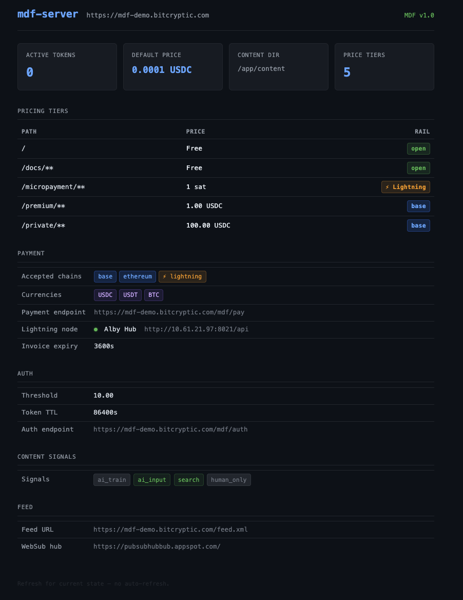

# mdf-reference-server

Reference implementation of the [MDF (Markdown First)](https://github.com/bitcryptic-gw/mdf) spec.

A self-hostable server that serves markdown natively to AI agents via HTTP content negotiation, with structured discovery, payment-gated content tiers, and bearer token auth. Built with Bun, configured via a single YAML file, runs as a non-root Docker container.

**Live demo:** https://mdf-demo.bitcryptic.com  
**Spec:** https://github.com/bitcryptic-gw/mdf  
**Status:** v0.1.0-draft — payment verification is stubbed; see [open milestones](#status)



---

## Quick start

```bash
# Clone
git clone https://github.com/bitcryptic-gw/mdf-reference-server.git
cd mdf-reference-server

# Create the secrets directory and wallet address file
mkdir -p secrets
echo -n 0xYourWalletAddress > secrets/wallet_address
chmod 600 secrets/wallet_address

# Build and run
docker compose up --build
```

The server listens on port 3030 (host) → 3000 (container). The dashboard is on port 9090, no external mapping — access via Tailscale or internal network.

---

## Try it

```bash
# Discover the site's MDF capabilities
curl https://mdf-demo.bitcryptic.com/mdf.json

# Fetch the agent index
curl https://mdf-demo.bitcryptic.com/llms.txt

# Request markdown directly (agent-style)
curl -H "Accept: text/markdown" https://mdf-demo.bitcryptic.com/

# Free content — no payment required
curl -H "Accept: text/markdown" https://mdf-demo.bitcryptic.com/docs/getting-started

# Paid content — returns 402 with payment instructions
curl -H "Accept: text/markdown" https://mdf-demo.bitcryptic.com/premium/deep-dive

# Private content — returns 402 with auth endpoint hint
curl https://mdf-demo.bitcryptic.com/private/internals
```

---

## Configuration

All server configuration lives in `mdf.yaml`. The wallet address is never in config — it is read from `/run/secrets/wallet_address` at startup (file-mounted via Docker, not an env var).

```yaml
site:
  url: https://your-domain.com
  name: Your Site Name
  contact: admin@your-domain.com

pricing:
  default:
    amount: "0.0001"
    currency: USDC
    chain: base
  sections:
    /docs/**:
      amount: "0.0000"
    /premium/**:
      amount: "1.0000"
      currency: USDC
      chain: base
    /private/**:
      amount: "100.00"
      currency: USDC
      chain: base
```

See `mdf.yaml` in this repo for the full reference configuration.

---

## Content

Place markdown files under `content/`. The directory structure maps directly to URL paths. Frontmatter is supported. The server auto-generates `/mdf.json` and `/llms.txt` from `mdf.yaml` and the content directory at startup — no manual maintenance required.

---

## Payment rails

Both x402 (EVM/stablecoin) and L402 (Bitcoin/Lightning) are implemented as structural stubs — receipt shape is validated but on-chain settlement is not yet verified. Sites advertise accepted rails via `payment.accepted_chains` in `/mdf.json`.

Real verification is the next implementation milestone. See the [open issue](https://github.com/bitcryptic-gw/mdf/issues/3) for the x402 trust model discussion.

---

## Reverse proxy

A Caddy snippet is included at `caddy/Caddyfile`. Point your reverse proxy at port 3030.

---

## Status

| Feature | State |
|---------|-------|
| HTTP content negotiation (`Accept: text/markdown`) | ✅ Complete |
| `/mdf.json` + `/llms.txt` auto-generation | ✅ Complete |
| ETag / `Last-Modified` caching headers | ✅ Complete |
| x402 payment stub (EVM/stablecoin) | ✅ Stub |
| L402 payment stub (Bitcoin/Lightning) | ✅ Stub |
| Bearer token issuance (auth-via-payment) | ✅ Complete |
| Dashboard | ✅ Complete |
| x402 on-chain receipt verification | 🔲 Next milestone |
| L402 Lightning invoice verification | 🔲 Next milestone |
| Validator CLI | 🔲 Planned |
| Feed namespace (`mdf:change_type`) | 🔲 Planned |

---

## Development

```bash
bun install
bun run src/index.ts
```

Run the smoke tests:

```bash
bash smoke-test.sh
```

36 tests across content negotiation, discovery, payment stubs, and auth — all passing.

---

## Authors

**Gary Walker** / [BitCryptic™](https://bitcryptic.com)  
**Graham Hall** / [Slepner](https://slepner.com.au)

---

## License

MIT
