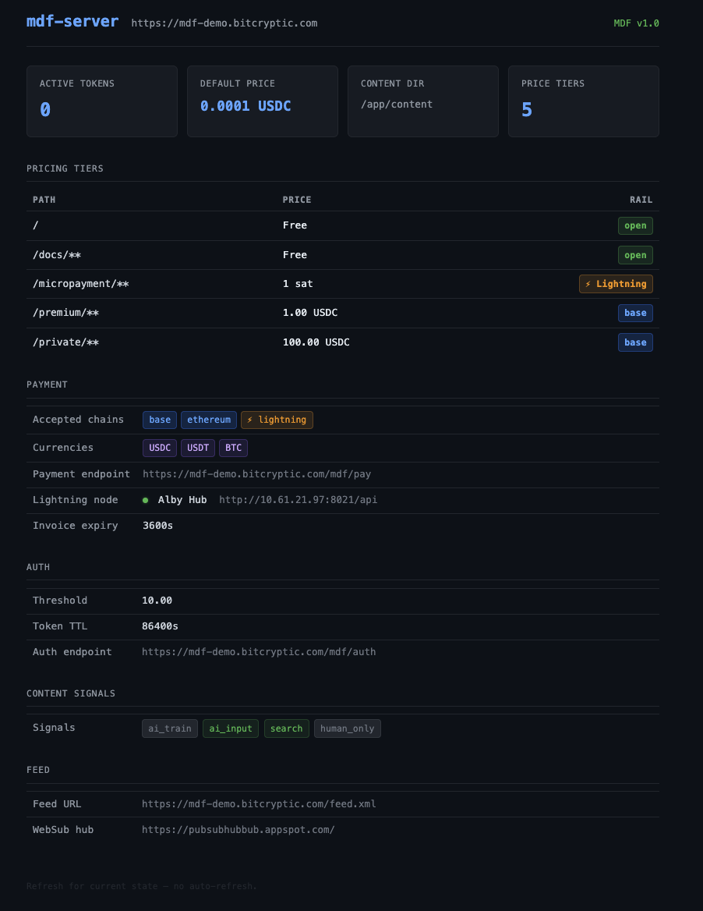

# mdf-reference-server

Reference implementation of the [MDF (Markdown First)](https://github.com/bitcryptic-gw/mdf) spec.

A self-hostable server that serves markdown natively to AI agents via HTTP content negotiation, with structured discovery, payment-gated content tiers, and bearer token auth. Built with Bun, configured via a single YAML file. The container runs as root only long enough for the Tailscale-in-container hook; the application itself runs as an unprivileged user (su-exec drops from root to `bun:bun`).

**Live demo:** https://mdf-demo.bitcryptic.com  
**Spec:** https://github.com/bitcryptic-gw/mdf  
**Status:** v0.1.5 — L402 (Lightning) payment verification is live and settles real invoices; x402 (EVM) payment verification remains stubbed; see [open milestones](#status)



---

## Quick start

```bash
# Clone
git clone https://github.com/bitcryptic-gw/mdf-reference-server.git
cd mdf-reference-server

# Create the secrets directory and wallet address file
mkdir -p secrets
echo -n 0xYourWalletAddress > secrets/wallet_address
chmod 600 secrets/wallet_address

# Build and run
docker compose up --build
```

The server listens on port 3030 (host) → 3000 (container). The dashboard is on port 9090, no external mapping — access via Tailscale or internal network.

---

## Try it

```bash
# Discover the site's MDF capabilities
curl https://mdf-demo.bitcryptic.com/mdf.json

# Fetch the agent index
curl https://mdf-demo.bitcryptic.com/llms.txt

# Request markdown directly (agent-style)
curl -H "Accept: text/markdown" https://mdf-demo.bitcryptic.com/

# Free content — no payment required
curl -H "Accept: text/markdown" https://mdf-demo.bitcryptic.com/docs/getting-started

# Paid content — returns 402 with payment instructions
curl -H "Accept: text/markdown" https://mdf-demo.bitcryptic.com/premium/deep-dive

# Micropayment tier over Lightning — returns 402 with an L402 invoice
curl -H "Accept: text/markdown" https://mdf-demo.bitcryptic.com/micropayment/intro

# Private content — returns 402 with auth endpoint hint
curl https://mdf-demo.bitcryptic.com/private/internals

# Atom feed with mdf:change_type metadata
curl https://mdf-demo.bitcryptic.com/feed.xml
```

---

## Configuration

All server configuration lives in `mdf.yaml`. Secrets are resolved at startup in precedence order — from `/run/secrets/<name>` files, then `MDF_*` environment variables, then any value in `mdf.yaml`. In the provided Compose setup the wallet address is mounted as `/run/secrets/wallet_address` (a file, never an env var); the Alby and Lightning-token secrets are mounted the same way. A non-zero price with no resolvable wallet, or a configured Lightning block with no token secrets, aborts startup with a descriptive error.

```yaml
site:
  url: https://your-domain.com
  name: Your Site Name
  contact: admin@your-domain.com

pricing:
  default:
    amount: "0.0001"
    currency: USDC
    chain: base
  sections:
    /docs/**:
      amount: "0.0000"
    /premium/**:
      amount: "1.0000"
      currency: USDC
      chain: base
    /private/**:
      amount: "100.00"
      currency: USDC
      chain: base
```

See `mdf.yaml` in this repo for the full reference configuration.

---

## Content

Place markdown files under `content/`. The directory structure maps directly to URL paths. Frontmatter is supported. The server auto-generates `/mdf.json` and `/llms.txt` from `mdf.yaml` and the content directory at startup — no manual maintenance required.

---

## Payment rails

Two rails are implemented:

**L402 (Bitcoin/Lightning)** — production-complete. Creates real Lightning invoices via Alby Hub, issues HMAC-bound macaroons, and verifies preimage submission against settled invoice records.

**x402 (EVM/stablecoin)** — structural stub. Receipt shape is validated but on-chain settlement is not yet verified. See the [open issue](https://github.com/bitcryptic-gw/mdf/issues/3) for the x402 trust model discussion.

Sites advertise accepted rails via `payment.accepted_chains` in `/mdf.json`.

---

## Reverse proxy

A Caddy snippet is included at `caddy/Caddyfile`. Point your reverse proxy at port 3030. The server exposes `/health` (200 when the content and data directories are accessible, 503 otherwise) for load-balancer health checks; since 0.1.5 the image's own Docker `HEALTHCHECK` probes it.

---

## Status

| Feature | State |
|---------|-------|
| HTTP content negotiation (`Accept: text/markdown`) | ✅ Complete |
| `/mdf.json` + `/llms.txt` auto-generation | ✅ Complete |
| ETag / `Last-Modified` caching headers | ✅ Complete |
| Atom feed with `mdf:change_type` extension | ✅ Complete |
| WebSub hub declaration | ✅ Complete |
| Bearer token issuance (auth-via-payment) | ✅ Complete |
| Dashboard | ✅ Complete |
| L402 payment verification (Bitcoin/Lightning) | ✅ Complete |
| Validator CLI | ✅ Complete |
| x402 on-chain receipt verification | 🔲 Next milestone |

---

## Development

```bash
bun install
bun run src/index.ts
```

Run the smoke tests:

```bash
bash smoke-test.sh
```

36 tests across content negotiation, discovery, payment stubs, and auth — all passing.

---

## Authors

**Gary Walker** / [BitCryptic™](https://bitcryptic.com)  
**Graham Hall** / [Slepner](https://slepner.com.au)

---

## License

MIT
